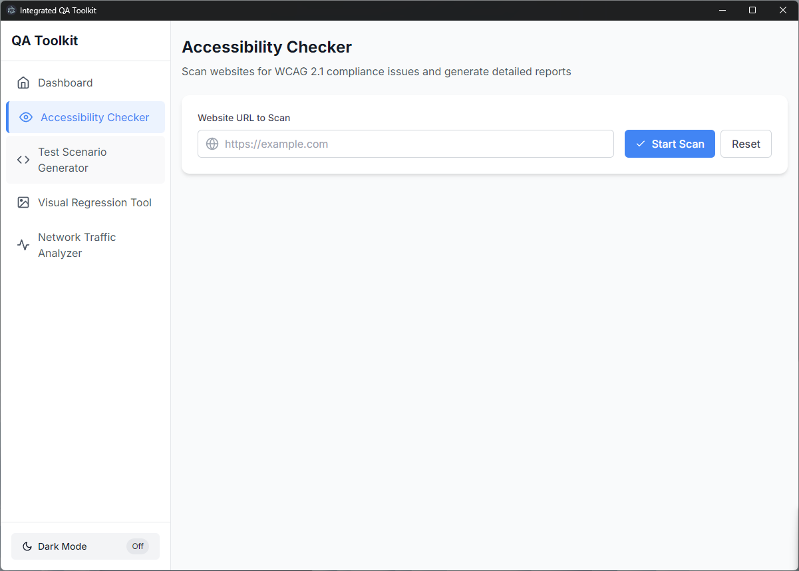

# Integrated QA Toolkit - Gallery

This gallery showcases the main features and interfaces of the Integrated QA Toolkit, demonstrating how it streamlines QA processes through its intuitive UI.

## Dashboard

The main dashboard provides quick access to all key modules of the application. The clean interface features a dark/light mode toggle and intuitive navigation.

## Accessibility Checker

The Accessibility Checker allows users to scan websites for WCAG 2.1 compliance issues. Simply enter a URL and receive a comprehensive report highlighting accessibility concerns.

The results page displays detected issues with severity levels and recommended fixes for better web accessibility.

## Test Scenario Generator

Generate test cases from user flows by inputting structured data. The generator creates ready-to-use test scripts for automation frameworks.

Generated Cypress test code that can be directly integrated into your testing workflow.

Generated Selenium test code with Python, ready for implementation in your testing suite.

## Visual Regression Tool

Upload baseline and test images to identify visual differences. The tool highlights pixel-level changes for thorough visual testing.

The comparison results are displayed with clear highlighting of any differences found between the images, making it easy to identify UI changes.

## Network Traffic Analyzer

Monitor API requests and responses in real-time. The analyzer detects slow endpoints and enables you to export traffic logs for further analysis.

Detailed view of captured network traffic with timing information, status codes, and response data for comprehensive API monitoring.

## Key Benefits

- **Unified Interface**: All testing tools in one application
- **Consistent Experience**: Seamless workflow between different testing activities
- **Time Saving**: Automation of common QA tasks
- **Cross-Platform**: Works on both Windows and macOS
- **Customizable**: Adapt to your specific testing requirements

---

The Integrated QA Toolkit simplifies the quality assurance process by bringing essential tools together under a single, intuitive interface, making testing more efficient and accessible for teams of all sizes. 