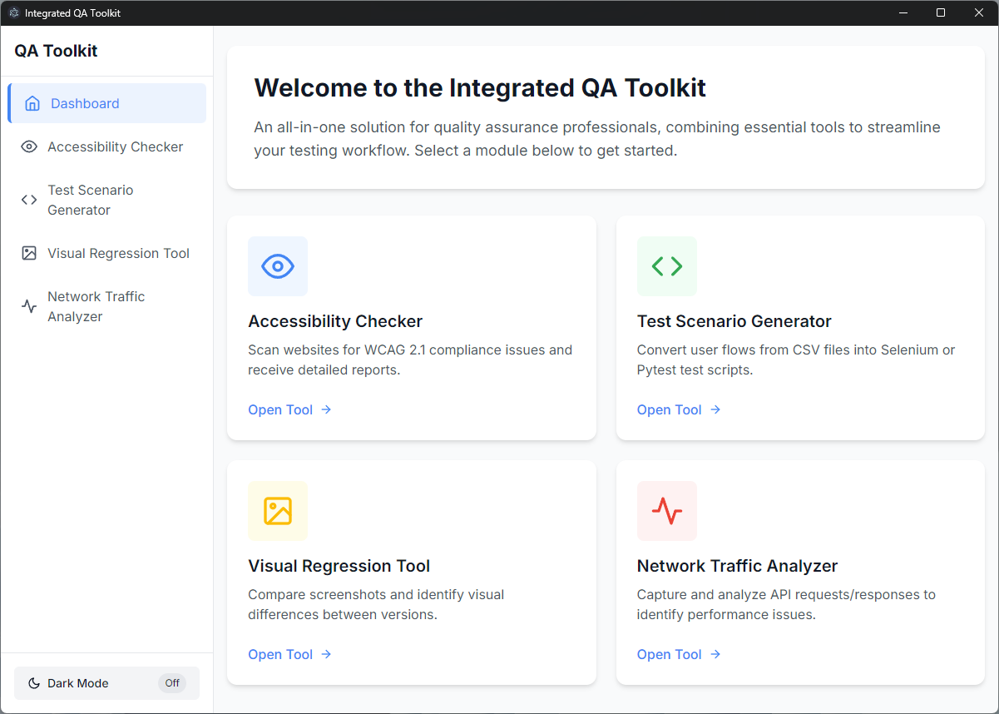

# Integrated QA Toolkit



A comprehensive desktop application that combines essential QA tools into a unified, user-friendly interface. Built with Electron and React, this toolkit streamlines quality assurance processes across multiple platforms.

## Features

- **Accessibility Checker**: Scan websites for WCAG 2.1 compliance issues
- **Test Scenario Generator**: Create test cases from user flows
- **Visual Regression Tool**: Compare screenshots and identify visual differences
- **Network Traffic Analyzer**: Monitor API requests and response times

## Getting Started

### Prerequisites

- **Node.js** (v14+) and npm
- **Python** (v3.8+) with pip for specific modules

### Installation

```bash
# Clone the repository
git clone https://github.com/yourusername/integrated-qa-toolkit.git

# Navigate to project directory
cd integrated-qa-toolkit

# Install dependencies
npm install

# Install Python dependencies (optional - for all modules)
npm run setup-python
```

### Development

```bash
# Start the application in development mode
npm run dev
```

This will launch the application with hot-reloading enabled.

### Building the Application

```bash
# Build React app and package for Windows
npm run build-win

# Build for macOS
npm run build-mac
```

After building, you can find the executable in:
- Windows: `dist/Integrated QA Toolkit-win32-x64/Integrated QA Toolkit.exe`
- macOS: `dist/Integrated QA Toolkit-darwin-x64/Integrated QA Toolkit.app`

## Recent Updates

- Improved build process for Windows with better file handling
- Fixed React rendering issues in packaged application
- Removed unnecessary menu bars for cleaner interface
- Enhanced error handling with detailed debug information
- Optimized file paths for cross-platform compatibility

## Project Structure

```
integrated-qa-toolkit/
├── electron/         # Electron main process
│   ├── main.js       # Application entry point
│   └── preload.js    # Preload script for IPC
├── src/
│   ├── react-ui/     # React components
│   ├── python/       # Python backend scripts
│   └── node/         # Node.js services
├── build/            # Build assets and icons
└── dist/             # Generated distribution packages
```

## Technology Stack

- **Electron**: Cross-platform desktop framework
- **React**: UI library
- **Tailwind CSS**: Styling framework
- **Node.js**: Backend services
- **Python**: Data processing and test generation

## Troubleshooting

If you encounter a blank screen when running the packaged application:

1. Try rebuilding the application with `npm run build` followed by `node portable-build.js`
2. Check that you have all required dependencies installed
3. For detailed logs, run the executable from the command line

## License

MIT

## Contributors

- Your Name
- Other Contributors

## Screenshots

See the [GALLERY.md](GALLERY.md) file for screenshots and feature highlights. 